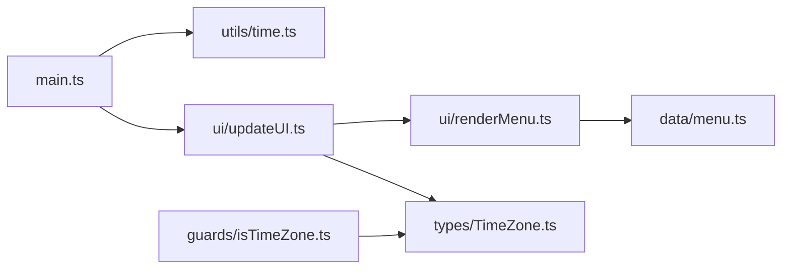

# Forest Caffe

時間帯によって世界観が変化する、インタラクティブなカフェサイトです。  
TypeScript と Vite を用いて開発し、UI状態管理・責務分離・型安全性を意識して設計しています。

---

## Overview

Forest Caffe は、  
「朝・昼・夜」で異なる雰囲気を楽しめるカフェ体験をテーマにした Web アプリケーションです。

ユーザー操作や現在時刻に応じて、

- 背景画像
- キャッチコピー
- メニュー表示

が動的に切り替わります。

---

## Features

- 時間帯に応じたテーマ変更
- 動的な背景画像切り替え
- メニューの動的レンダリング
- 型安全な UI 更新処理
- モジュール分割による保守性向上
- ガラスモーフィズムを用いたUIデザイン

---

## Tech Stack

| Category | Technology |
|---|---|
| Language | TypeScript |
| Build Tool | Vite |
| Styling | CSS3 |
| Package Manager | npm |

---

## Architecture

```txt
src/
├─ data/
│  └─ menu.ts            # メニューデータ管理
│
├─ guards/
│  └─ isTimeZone.ts      # 型ガード
│
├─ images/               # UI画像管理
│
├─ types/
│  └─ TimeZone.ts        # 型定義
│
├─ ui/
│  ├─ renderMenu.ts      # メニュー描画
│  └─ updateUI.ts        # UI状態更新
│
├─ utils/
│  └─ time.ts            # 時間帯判定ロジック
│
└─ main.ts               # エントリーポイント
```

---

## Application Flow

Start[Application Start] --> GetTime[getTimeZone()]
GetTime --> UpdateUI[updateUI()]

UpdateUI --> ChangeHero[Update Hero Theme]
UpdateUI --> UpdateTitle[Update Message]
UpdateUI --> RenderMenu[renderMenu()]

RenderMenu --> MenuData[menus.ts]

UserClick[Button Click] --> UpdateUI
```

---

## Module Relationship



---

## Design Principles

本プロジェクトでは、以下を重視して設計しています。

### Separation of Concerns

UI更新・データ管理・ロジックを分離し、
責務を明確化しています。

### Type Safety

TypeScript を用いて、
実行時エラーを防ぐ設計を意識しています。

### Maintainability

機能単位でファイルを分割し、
拡張・修正しやすい構成を採用しています。

### Reusability

UI更新処理や描画処理を関数化し、
再利用可能な設計にしています。

---

## Getting Started

### Install

```bash
npm install
```

### Start Development Server

```bash
npm run dev
```

### Build

```bash
npm run build
```

---

## Future Improvements

- レスポンシブ対応
- LocalStorageによる状態保持
- ダークモード切り替え
- アニメーション最適化
- API連携
- React + Component Architecture への移行

---

## Screenshots

Coming Soon...

---

## Author

GitHub: Km
